# 🔐 Secure Credential Manager

A **Secure Credential Manager** built using the **MERN stack (MongoDB, Express, React, Node.js)** with advanced cryptographic features to ensure maximum security. It uses `CryptoJS` and `bcrypt` for encryption and hashing, and `JWT` for session management.

---

## 🚀 Features

- 🔐 **User Authentication** using hashed passwords (`bcrypt`)
- 🔐 **JWT-based Session Management** (expires after 15 minutes)
- 🔐 **Protected Routes**: Only authenticated users can access sensitive routes
- 🔐 **Password Verification** required to perform sensitive operations (even with valid session)
- 🔐 **Credential Encryption** using a unique key .

- 🔐 **Encryption Keys are never stored** in the database or backend memory
- 🔐 **Sensitive data is cleared from memory immediately** after use
- 🔐 **Add / View / Delete credentials** securely
- ⚠️ **Mitigates session hijacking** via enforced re-verification using password


---

## 🧠 Tech Stack

- **Frontend**: React, Axios
- **Backend**: Node.js, Express.js
- **Database**: MongoDB with Mongoose
- **Encryption/Hashing**: CryptoJS, bcrypt
- **Auth & Session**: JSON Web Tokens (JWT)
- **Security Principles**: Zero knowledge encryption, protected routes, memory safety

---

## 🧰 How It Works

1. ### 🔐 User Registration & Login
 - Passwords are hashed using **bcrypt** before storing in DB.
 - On successful login, a **JWT token** is issued, valid for **15 minutes**.

2. ### 🛡️ Protected Routes
 - All sensitive backend routes require a valid **JWT token**.
 - Unauthorized users are blocked.

3. ### 🧾 Add / View / Delete Credentials
 - Each operation requires **password confirmation**, even if JWT is valid.
 - This ensures protection in case the session token is hijacked.

4. ### 🔑 Encryption Logic
 - Each credential is encrypted with a **unique key**:
   ```
   key = SHA256(salt + credentialUID + userPassword)
   ```
 - The key is never stored.
 - The encrypted data is stored, but key is derived on-the-fly during decryption.

5. ### 🧹 Memory Safety
 - Sensitive keys, raw passwords, and decrypted data are **immediately removed** from memory after use.

---


## 📸 Screenshots

### Landing Page
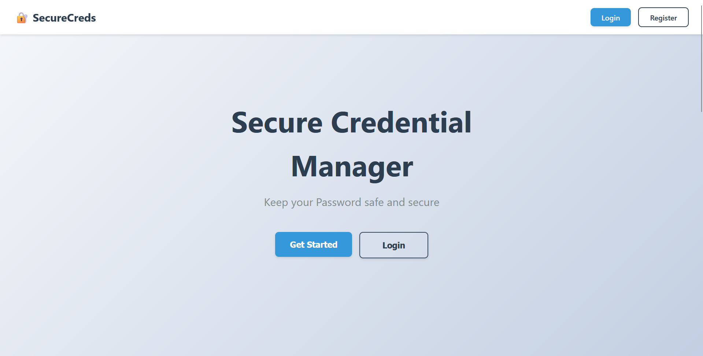
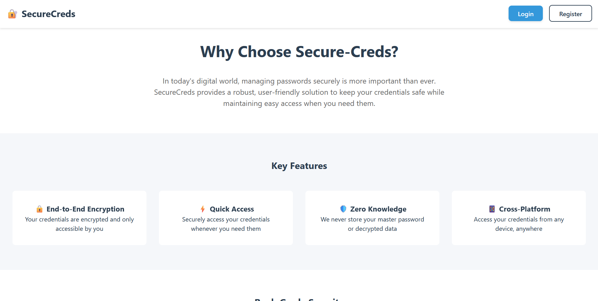
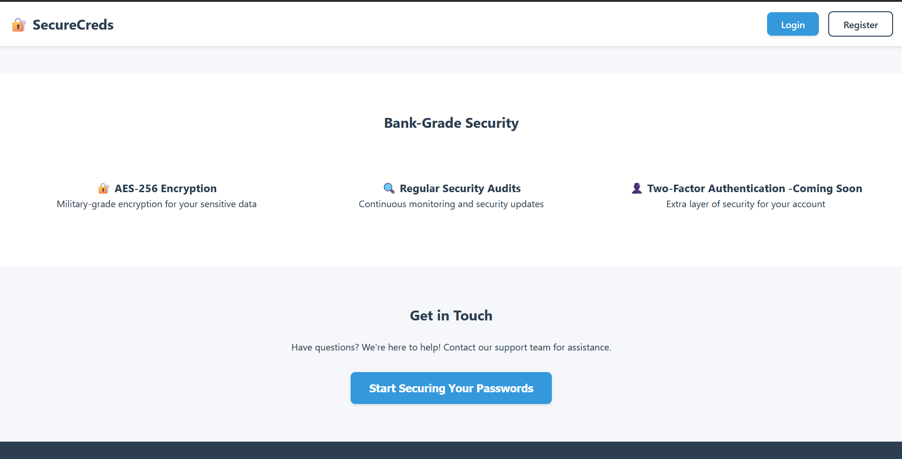
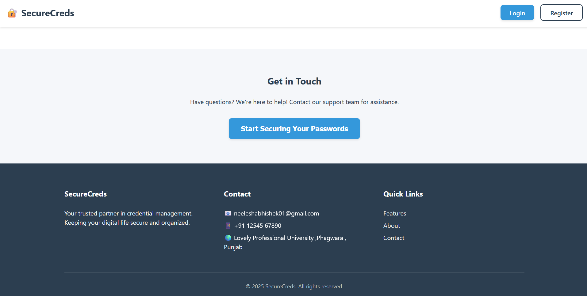

### 🖥️ Registration Page
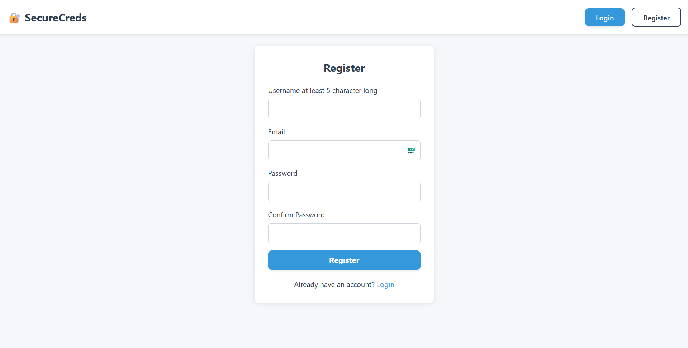

### 🖥️ Login Page
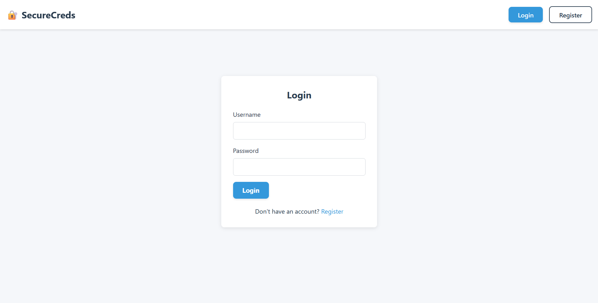

### 🏠 Dashboard
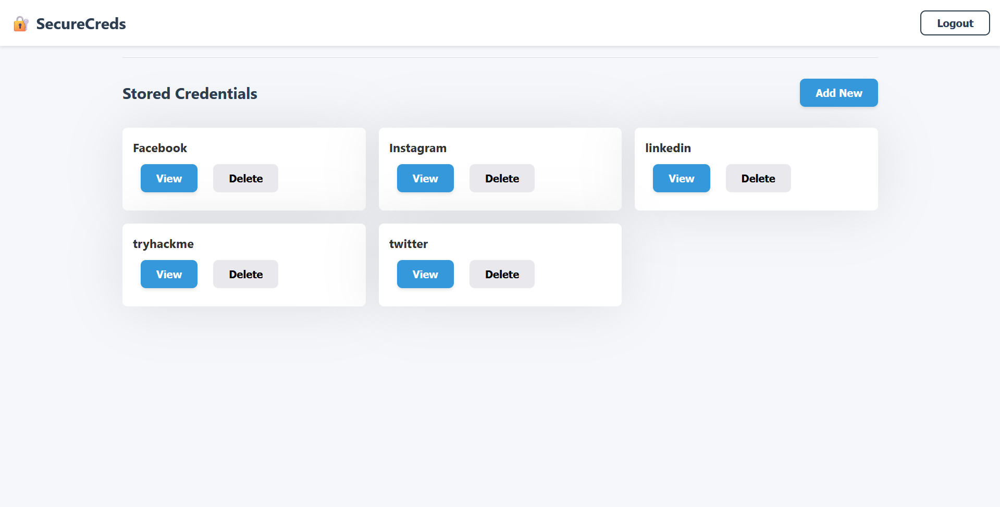

### 🔐 Add Credential
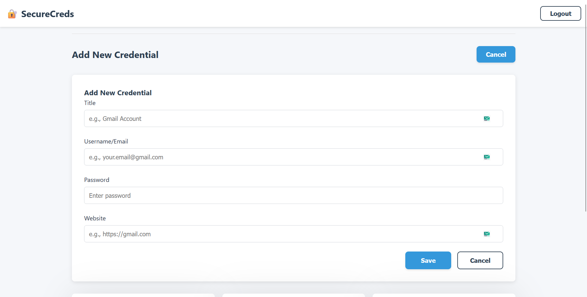
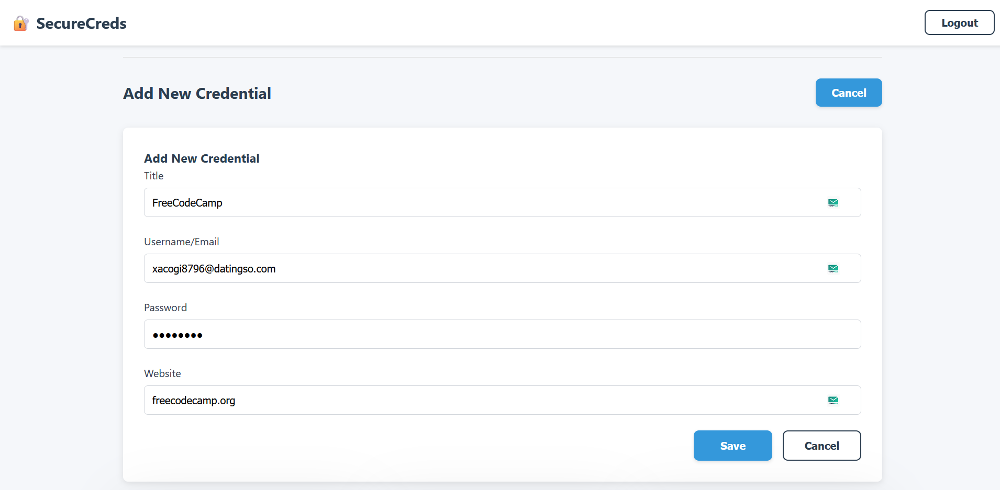
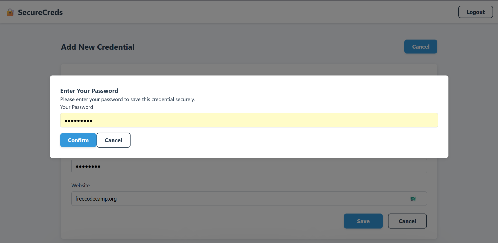
- After adding creds
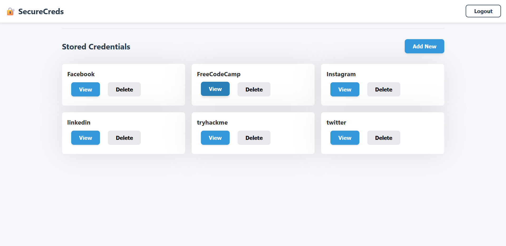

### 🗂️ View Credentials
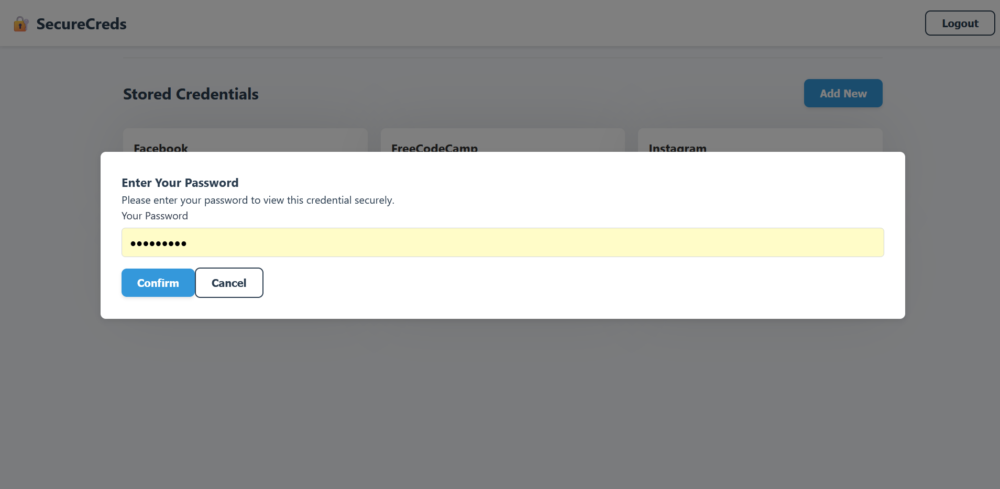
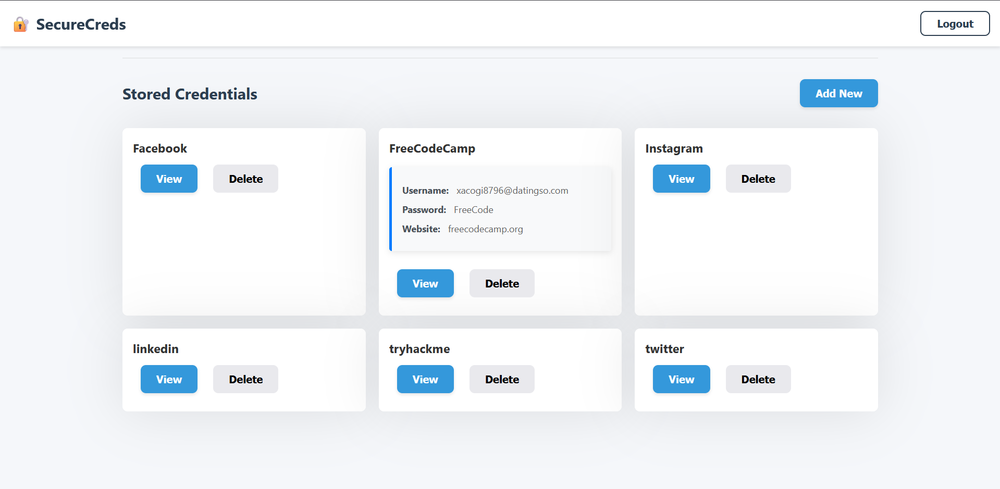

### 🧰 Delete Credentials
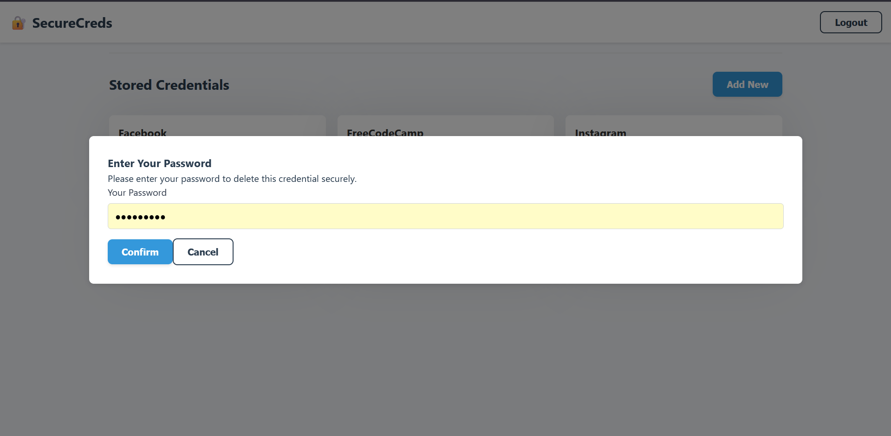
- After Deleting

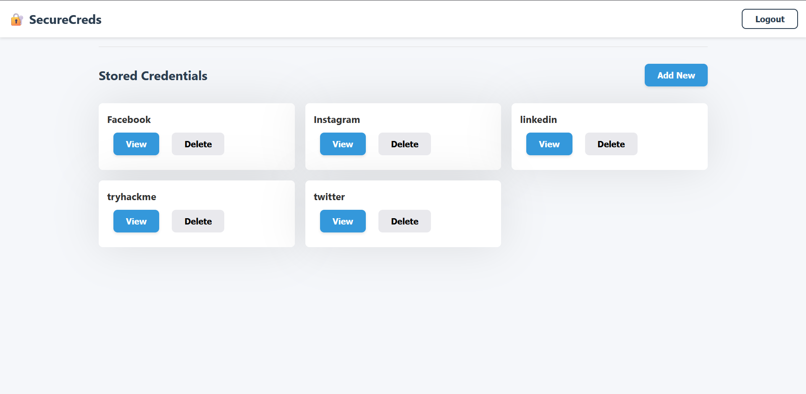


## 🛠️ Setup Instructions

### ⚙️ Prerequisites

- Node.js and npm
- MongoDB and mongoose
- Git

### 📦 Installation

```bash
git clone https://github.com/Abhishek-Verma0/PETV83L-Abhishek-Verma-Secure-Credential-Manager-With-Key-Encryption.git

# Install backend dependencies
cd server
npm install

# Setup environment variables
# Add your MongoDB URI and JWT_SECRET in the .env file
  # Server .env
    MONGODB_URL=your mongo url
    JWT_SECRET= your jwt secret
    PORT=5000
  # client .env
   VITE_API_URL= http://localhost:5000/
   VITE_PORT=5173

# Start backend server
npm run dev

# Open new terminal for frontend
cd ../client
npm install

# Start frontend
npm start

```


## 🌟 Support & Contributions

If you like this project, please consider giving it a ⭐ on [GitHub](https://github.com/Abhishek-Verma0/PETV83L-Abhishek-Verma-Secure-Credential-Manager-With-Key-Encryption.git)!

### 🤝 Contributing

Contributions are welcome and appreciated!


# 🤝 Contributing to Secure Credential Manager

Thank you for considering contributing to **Secure Credential Manager**! We welcome contributions from developers of all experience levels. Follow this guide to help you get started.

---

## 📋 Table of Contents

- [Getting Started](#getting-started)
- [Code Guidelines](#code-guidelines)
- [Git Guidelines](#git-guidelines)
- [Issue Reporting](#issue-reporting)
- [Submitting a Pull Request](#submitting-a-pull-request)
- [Code of Conduct](#code-of-conduct)

---

## 🏁 Getting Started

1. **Fork the Repository**

   - Click the "Fork" button on the top right of [this repo](https://github.com/Abhishek-Verma0/PETV83L-Abhishek-Verma-Secure-Credential-Manager-With-Key-Encryption.git).

2. **Clone your Fork**

   ```bash
   git clone https://github.com/Abhishek-Verma0/PETV83L-Abhishek-Verma-Secure-Credential-Manager-With-Key-Encryption.git
   cd PETV83L-Abhishek-Verma-Secure-Credential-Manager-With-Key-Encryption
   ```

3. **Install Dependencies**

   - Backend:
     ```bash
     cd server
     npm install
     ```
   - Frontend:
     ```bash
     cd ../client
     npm install
     ```

4. **Run the App Locally**

   - Backend:
     ```bash
     npm run dev
     ```
   - Frontend:
     ```bash
     npm start
     ```

---

## 🧑‍💻 Code Guidelines

- Write **clean, readable code**.
- Use **meaningful commit messages**.
- Add **comments** for complex logic.
- Follow the existing **folder structure** and **naming conventions**.
- **Test** your features before submitting.

---

## 🌿 Git Guidelines

- Work in a **new branch**:
  ```bash
  git checkout -b feature/your-feature-name
  ```
- **Rebase or merge** latest changes from main before pushing.
- Push to your fork and open a **pull request**.

---

## 🐞 Issue Reporting

If you find a bug or want to request a feature:

1. Go to [Issues](https://github.com/Abhishek-Verma0/PETV83L-Abhishek-Verma-Secure-Credential-Manager-With-Key-Encryption.git).
2. Click `New Issue`.
3. Fill in the template clearly.

Please include logs, screenshots, or steps to reproduce when applicable.

---

## 📤 Submitting a Pull Request (PR)

1. Commit your changes:
   ```bash
   git add .
   git commit -m "Add: your-feature-name"
   ```
2. Push your branch:
   ```bash
   git push origin feature/your-feature-name
   ```
3. Go to your fork and click `Compare & Pull Request`.
4. Provide a **clear description** of your changes.
5. Wait for review and feedback!

---

## 💬 Code of Conduct

We follow the [Contributor Covenant](https://www.contributor-covenant.org/) Code of Conduct:

- Be respectful.
- No harassment or discrimination.
- Keep the community open and inclusive.

---

Thank you again for your interest in contributing! 💙

Happy coding! 🚀

